> **САНКТ-ПЕТЕРБУРГСКИЙ НАЦИОНАЛЬНЫЙ ИССЛЕДОВАТЕЛЬСКИЙ УНИВЕРСИТЕТ
> ИТМО**

**Дисциплина**: Продвинутые методы оптимизации

**Отчет по Лабораторной номер 1**

**«Конструктивные числа и методы оптимизации»**

**Выполнили:**

Васюнина София, Ису: 465370, группа: J3214

Автономова Ксения, Ису: 464931, группа: J3213

Лорс Алина, 474321, Ису: группа: J3214

> Санкт-Петербург
>
> 2026 г.

# 1. Цель работы

Целью лабораторной работы является реализация типа данных «конструктивное число», совместимого с вычислением значений целевых функций, а также реализация и исследование методов оптимизации 0-го, 1-го и 2-го порядков.

# 2. Постановка задачи

Реализовать тип данных, поддерживающий создание из вещественного числа и параметра точности либо из пары границ, нативные арифметические операции, операции сравнения и получение вещественного значения через параметр α.

Кроме того, нужно было реализовать три тестовые функции с единым интерфейсом, методы оптимизации 0-го и 1-го порядков, а также провести экспериментальное исследование: сравнить скорость и качество сходимости, подобрать learning rate для градиентного спуска и проанализировать поведение ε в процессе оптимизации.

В качестве дополнительного задания реализован метод Ньютона.

Check_list:

- реализовать тип данных ConstructiveNumber, представляющий число в виде
  интервала \[a, b\];

- реализовать унифицированные тестовые функции (черные ящики),
  поддерживающие вычисление значения функции, градиента и матрицы Гессе;

- реализовать методы Нелдера--Мида, градиентный спуск и метод Ньютона;

- сравнить методы по скорости сходимости, точности решения и
  вычислительным затратам;

- исследовать влияние параметра learning rate и динамику изменения ε при
  работе с конструктивными числами.

# 3. Реализация конструктивного числа

## 3.1. Представление числа

В работе конструктивное число представлено как интервал \[a, b\], где a ≤ b. Ширина интервала ε = b − a интерпретируется как погрешность или  неопределенность значения. Для получения конкретного вещественного числа используется параметр α ∈ \[0, 1\]: x(α) = a + α·(b − a). При α = 0 выбирается левая граница, при α = 1 --- правая, при α = 0.5 середина интервала.

## 3.2. Создание и операции

Реализованы два способа создания объекта: из пары границ \[a, b\] и из вещественного числа x с заданной точностью ε, при которой строится симметричный интервал \[x − ε/2, x + ε/2\]. Для класса перегружены операции сложения, вычитания, умножения, деления и сравнения. Операции поддерживаются как между двумя конструктивными числами, так и между конструктивным и обычным вещественным числом.

Интервальная арифметика реализована по стандартным правилам: суммы и разности считаются по границам интервалов, произведение считается по всем комбинациям концов интервалов, а деление определяется через умножение на обратный интервал при условии, что знаменатель не содержит ноль.

## 3.3. Проверка корректности

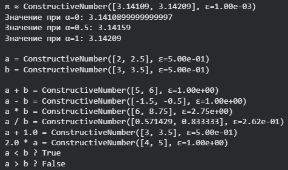

*Результат1*--- тесты корректности

В ноутбуке были выполнены простые тесты корректности. Для числа π, созданного как
ConstructiveNumber.from_real(3.14159, ε = 0.001), при α = 0, 0.5 и 1 были получены значения 3.14109, 3.14159 и 3.14209 соответственно, что подтверждает корректную работу параметра α. Также были проверены арифметические операции на интервалах a = \[2.0, 2.5\] и b = \[3.0, 3.5\].

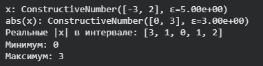

*Результат 2*--- тесты корректности

Отдельно была проверена функция abs: для x = \[−3, 2\] модуль дает \[0, 3\], что корректно покрывает все возможные значения \|x\| внутри исходного интервала.

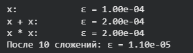

*Результат 3*--- тесты корректности

Проверка накопления погрешности показала ожидаемое поведение: при ε = 10⁻⁴ после сложения x + x погрешность увеличивается до 2·10⁻⁴, а при умножении x · x тоже возрастает. Это соответствует идее интервальной арифметики: неопределенность не
исчезает, а накапливается в ходе вычислений.

# 4. Черные ящики

Для экспериментов реализован базовый класс BlackBox с единым интерфейсом: \_\_call\_\_(x) для вычисления значения функции, gradient(x) для вычисления градиента и hessian(x) для вычисления матрицы Гессе. Также для каждой функции ведутся счетчики числа вызовов функции, градиента и Гессиана. Это позволило одинаково запускать разные методы оптимизации и затем сравнивать их по вычислительной стоимости.

Реализованы три функции:

1.  квадратичная 6-мерная функция с хорошей обусловленностью; минимум достигается в точке (1, 2, 3, 4, 5, 6);

2.  квадратичная 4-мерная функция с плохой обусловленностью; минимум достигается в точке (1, 2, 3, 4);

3.  3-мерная функция Розенброка; минимум достигается в точке (1, 1, 1).

Проверка значений в точках минимума показала, что во всех трех случаях функция действительно принимает значение 0. Для квадратичных функций также были вычислены числа обусловленности по матрице Гессе: для хорошо обусловленной задачи cond ≈ 1.22, для плохо обусловленной cond = 100.00. Таким образом, набор тестовых функций соответствует условию лабораторной работы.

Отдельно была проверена совместимость функций с конструктивными числами. Например, плохо обусловленная квадратичная функция на точке \[0, 0, 0, 0\], представленной через конструктивные числа с ε = 10⁻⁴, возвращает интервал \[2090.94, 2091.06\]. Функция Розенброка на конструктивных числах возвращает интервал \[1.9998, 2.0002\]. Это подтверждает, что интервальный режим вычислений реализован корректно.

# 5. Методы оптимизации

## 5.1. Нелдер--Мид

В качестве метода 0-го порядка реализован метод Нелдера--Мида. Он не использует производные и работает с симплексом из n + 1 вершин. На каждой итерации выполняются операции отражения, расширения, сжатия или редукции симплекса. Метод удобен тем, что не требует вычисления градиента, но делает много вызовов функции.

## 5.2. Градиентный спуск

В качестве метода 1-го порядка реализован градиентный спуск. Итерация имеет вид xₖ₊₁ = xₖ − η∇f(xₖ). В работе поддерживаются две стратегии выбора шага: фиксированный шаг и backtracking line search по условию Армихо. Остановка выполняется либо по малой норме градиента, либо по малому изменению значения функции.

## 5.3. Метод Ньютона

В качестве дополнительного задания реализован метод Ньютона. Его основная идея состоит в том, что на каждом шаге используется не только градиент функции, определяющий направление убывания, но и матрица вторых производных гессиан, которая учитывает кривизну поверхности функции. Благодаря этому метод Ньютона обычно сходится значительно быстрее, чем методы первого порядка.

В основе метода лежит локальная квадратичная аппроксимация функции в окрестности текущей точки. Минимум этой квадратичной модели принимается в качестве следующего приближения. Итерационный процесс задается формулой:
$$x_{k + 1} = x_{k} - \gamma\lbrack\nabla^{2}f(x_{k})\rbrack^{- 1}\nabla f(x_{k}),$$

$\nabla f(x_{k})$ - вектор градиента функции в точке $x_{k}$
$\nabla^{2}f(x_{k})$ - матрица Гессе, то есть матрица вторых частных производных;
$\gamma$ - параметр шага

Направление шага $p_{k}$определяется как решение системы линейных уравнений

$$\nabla^{2}f(x_{k})\text{ }p_{k} = - \nabla f(x_{k}).$$
После нахождения направления $p_{k}$новое приближение вычисляется по формуле

$$x_{k + 1} = x_{k} + \gamma p_{k}.$$
Главным достоинством метода Ньютона является высокая скорость сходимости. В окрестности точки минимума он обладает квадратичной скоростью сходимости, то есть число верных знаков решения примерно удваивается на каждой итерации.

Основной недостаток метода связан с высокой вычислительной сложностью. На каждой итерации необходимо вычислять гессиан и решать систему линейных уравнений размерности $D \times D$, что требует больших вычислительных затрат. Для задач большой размерности это делает метод существенно более дорогим по времени по сравнению с градиентным спуском.

Критерием остановки обычно служит выполнение условия
$\parallel \nabla f(x_{k}) \parallel < \varepsilon,$ 
$\varepsilon$ - заданная точность.

# 6. Постановка эксперимента

Все методы запускались из фиксированной начальной точки x₀ = 0 соответствующей размерности. Для каждой функции измерялись итоговое значение функции f(x\*), число итераций, количество вызовов функции и градиента, а также время работы. Для квадратичных функций и функции Розенброка использовались истинные координаты минимума, что позволяло дополнительно оценивать близость найденной точки к точному решению.

В ноутбуке также сохранялась история движения метода: последовательность точек xₖ и значений f(xₖ). Это позволило построить графики сходимости, траектории движения по линиям уровня и графики динамики ε-значений функции при работе с конструктивными числами.

# 7. Результаты экспериментов

## 7.1. Проверка на простой квадратичной функции

На 6-мерной хорошо обусловленной квадратичной функции метод Нелдера--Мида сошелся за 462 итерации и 740 вызовов функции, найдя минимум \[1, 2, 3, 4, 5, 6\] с расстоянием до истинного решения 4.65·10⁻⁹. Градиентный спуск с фиксированным шагом lr = 0.1 сошелся за 53 итерации, а градиентный спуск с backtracking за 7 итераций. Уже на этом этапе видно, что для хорошо обусловленной квадратичной функции градиентный метод значительно эффективнее безградиентного.

## 7.2. Сравнение Нелдера--Мида и градиентного спуска

Основные результаты запуска методов на трех тестовых функциях приведены в таблице 1

  ------------------------------------------------------------------------------------------------------
  **Метод**                **Функция**              **f(x\*)**            **Итер.**    **Вызовы f**   **Вызовы**   **Время**   **Сошёлся**
  --------------- -------------- ------------ ----------- ---------- ---------- ---------- -------------
  Нелдер--Мид     Квадратичная    2.181e-17       462        740           0           0.0864        да
  (0-й порядок)   6-мерная, хорошая                                                                                                   

  Градиентный     Квадратичная     2.43e-11         6            20             7           0.0005        да
  спуск (lr=0.5,      6-мерная,                                                                
  backtracking)      хорошая                                                                  

  Нелдер--Мид     Квадратичная    1.417e-16       248         431            0           0.0390        да
  (0-й порядок)     4-мерная, плохая                                                                   

  Градиентный     Квадратичная    8.116e-06        266         2289          267       0.0500        да
  спуск (lr=0.5,      4-мерная,                                                                
  backtracking)      плохая                                                                   

  Нелдер--Мид     Розенброк       2.567e-17          191          345          0             0.0234        да
  (0-й порядок)     3-мерный                                                                 

  Градиентный     Розенброк       2.007e-04           2953       32651       2954        0.4892        да
  спуск (lr=0.5,      3-мерный                                                                 
  backtracking)                                                                            

*Таблица 1 --- Сравнение Нелдера--Мида и градиентного спуска на трех
тестовых функциях*

Видно, что на хорошо обусловленной квадратичной функции градиентный спуск значительно превосходит Нелдера--Мида по числу итераций и вызовов функции. На плохо обусловленной квадратичной функции его эффективность падает: метод все еще сходится, но требует намного больше вычислений. На функции Розенброка градиентный спуск оказывается самым медленным методом из двух сравниваемых, тогда как Нелдер--Мид показывает устойчивое поведение и достигает практически нулевого значения функции за
приемлемое число итераций.

## 7.3. Графики сходимости

На рисунках 1--3 показаны графики зависимости значения f(xₖ) от номера итерации в логарифмической шкале, они демонстрируют различие поведения методов на задачах разной сложности.

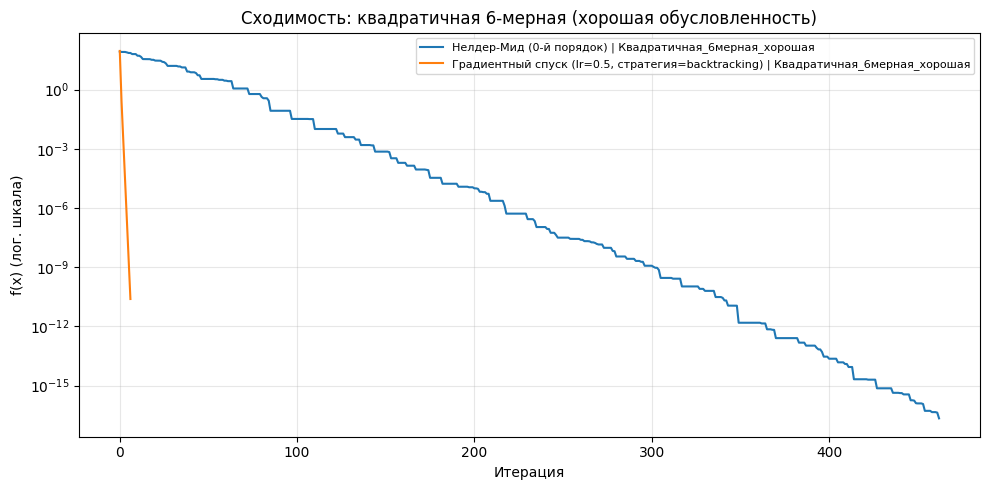

*Рисунок 1 --- Сходимость на хорошо обусловленной квадратичной функции*

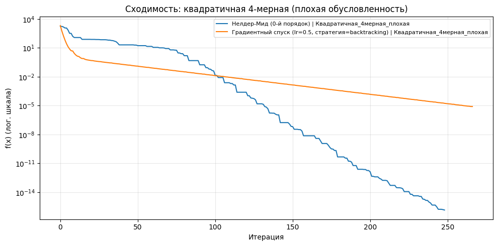

*Рисунок 2 --- Сходимость на плохо обусловленной квадратичной функции*

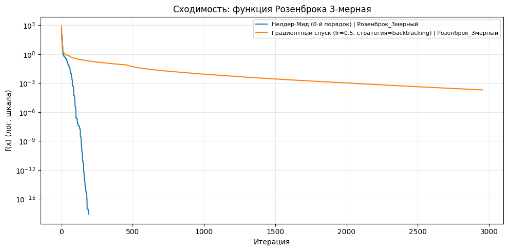

*Рисунок 3 --- Сходимость на функции Розенброка*

На хорошо обусловленной квадратичной функции кривая градиентного спуска резко уходит вниз уже в начале процесса, а на плохо обусловленной функции становится заметно, что он требует большего числа итераций. На функции Розенброка спуск вдоль извилистой долины делает градиентный метод особенно долгим.

## 7.4 Подбор learning rate для градиентного спуска

Для плохо обусловленной квадратичной функции отдельно был проведен
эксперимент с фиксированным шагом. Результаты приведены в таблице 2.

  ----------------------------------------------------------------------------------
    **lr**                **f(x\*)**                   **Итер.**           **Вызовы** f  **Вызовы grad**   **Время**   **Сошёлся**
  ---------- ------------ ----------- ---------- ---------- ---------- -------------
    0.0001       0.1353                   5000               5002            5000           0.2199                 нет

    0.0005    4.517e-05      5000        5002       5000      0.3360        нет

    0.001     2.486e-06      3223        3225       3224      0.1840        да

    0.002     1.237e-06      1697        1699       1698      0.0744        да

    0.005     4.881e-07       723        725        724       0.0318        да

    0.009     2.636e-07       417        419        418       0.0145        да
  ----------------------------------------------------------------------------------

*Таблица 2 --- Влияние learning rate на работу градиентного спуска*

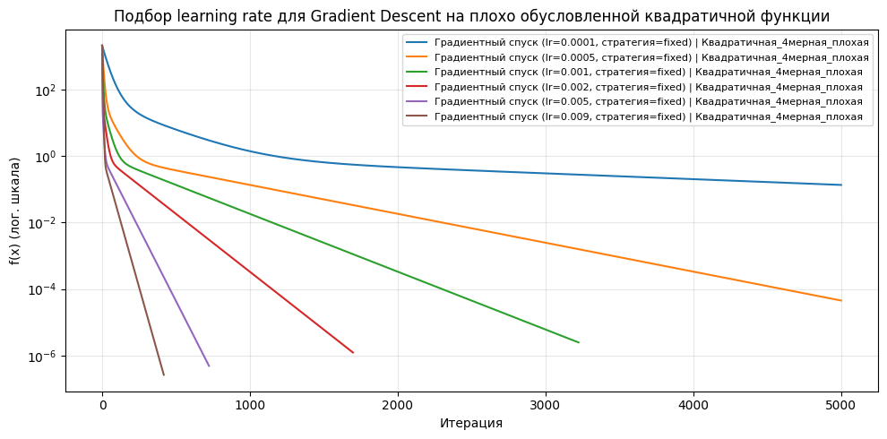

*Рисунок 4 --- Подбор learning rate для плохо обусловленной квадратичной
функции*

Эксперимент показывает, что при слишком малом шаге (10⁻⁴ и 5·10⁻⁴) метод движется к минимуму слишком медленно и не успевает сойтись за 5000 итераций. Начиная с lr = 0.001 метод уже сходится, а наилучший результат среди проверенных значений показывает lr = 0.009. Это хорошо согласуется с теорией: «для плохо обусловленных задач выбор шага критически важен.»

## 7.5. Траектории движения методов

Для плохо обусловленной квадратичной функции и функции Розенброка были построены траектории движения методов по линиям уровня. На рисунках 5--8 видно, что Нелдер--Мид перемещается геометрически, деформируя симплекс, а градиентный спуск идет по более гладкой кривой. На плохо обусловленной квадратичной функции у градиентного спуска проявляется характерное поведение вдоль вытянутого оврага ;) , а на функции Розенброка движение происходит вдоль изогнутой долины окак.

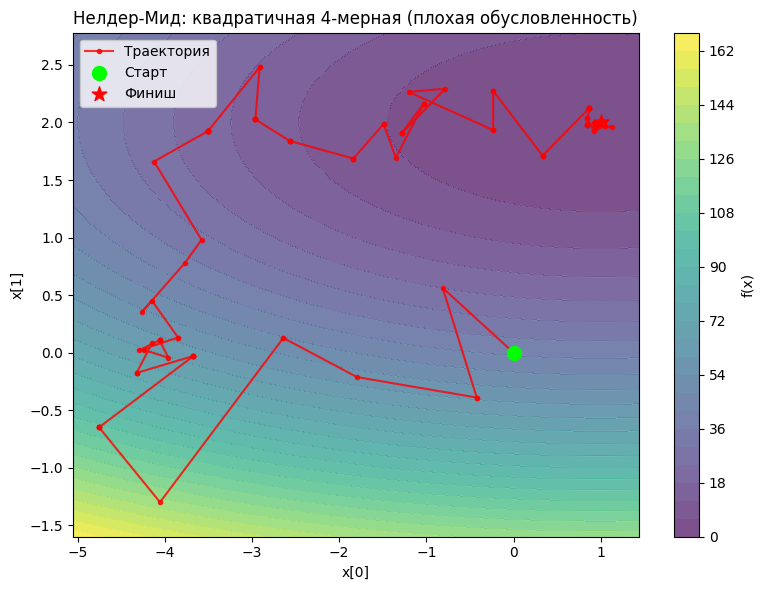

*Рисунок 5 --- Нелдер--Мид: квадратичная 4-мерная функция (плохая обусловленность)*

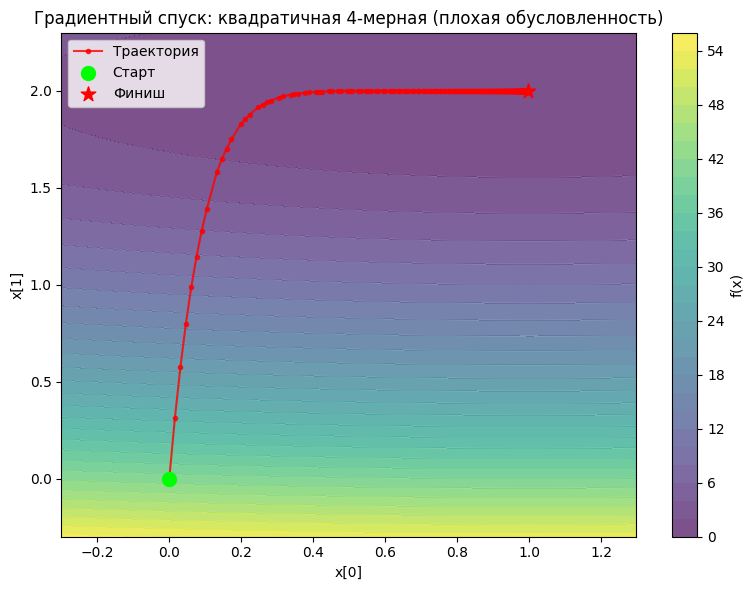

*Рисунок 6 --- Градиентный спуск: квадратичная 4-мерная функция (плохая обусловленность)*

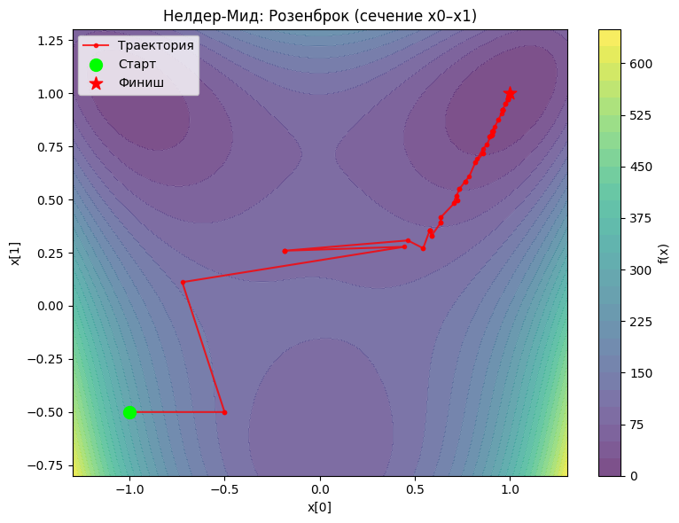

*Рисунок 7 --- Нелдер--Мид: функция Розенброка (сечение x0--x1)*

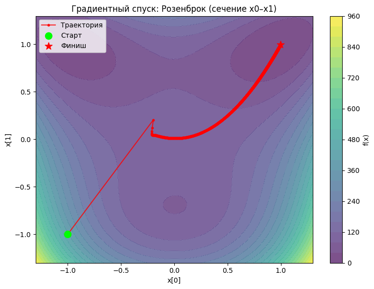

*Рисунок 8 --- Градиентный спуск: функция Розенброка (сечение x0--x1)*

## 7.6. Исследование динамики ε

Отдельная часть исследования была посвящена изменению ε в процессе оптимизации. В работе отслеживалась не сумма ε по координатам, а ε значения функции в конструктивной окрестности текущей точки. Для сравнения были взяты три стартовых значения: ε = 10⁻³, 10⁻⁵ и 10⁻⁷.

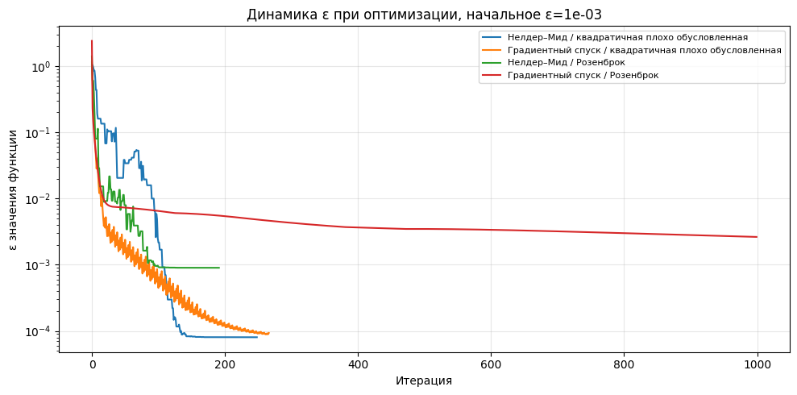

*Рисунок 9 --- Динамика ε при начальном ε = 10⁻³*

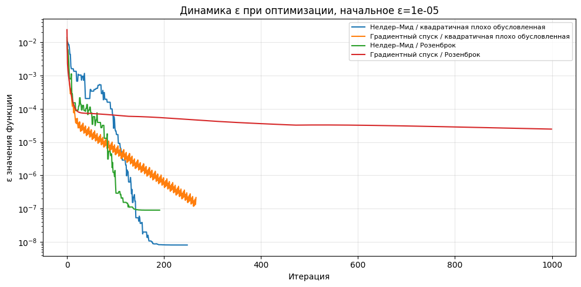

*Рисунок 10 --- Динамика ε при начальном ε = 10⁻⁵*

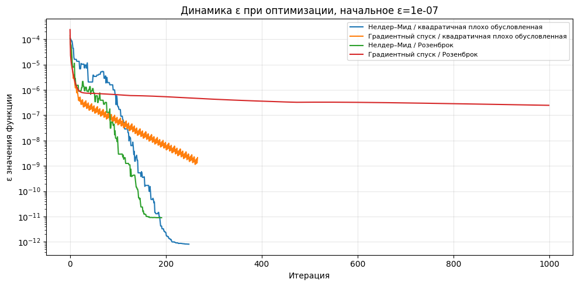

*Рисунок 11 --- Динамика ε при начальном ε = 10⁻⁷*

Графики показывают, что масштаб кривых ε зависит от начальной ширины интервала: чем больше стартовая неопределенность, тем выше весь график. При движении к минимуму ε значения функции убывает, однако характер убывания зависит и от метода, и от самой функции. Для функции Розенброка уменьшение ε происходит медленнее, чем для квадратичной функции, что объясняется более сложной геометрией поверхности. В целом конструктивные числа позволяют не только искать минимум, но и параллельно контролировать надежность вычислений.

## 7.7. Метод Ньютона

Результаты метода Ньютона приведены в таблице 3.

  --------------------------------------------------------------------------------------------------
  **Метод**         **Функция**           **f(x\*)**     **Итер.**   **Вызовы f**   **Вызовы grad**   **Время**,   **Сошёлся**   
  ----------- -------------- ------------ ----------- ---------- ---------- ---------- -------------
  Метод       Квадратичная        0            1          3                       2                0.0004        да
  Ньютона     6-мерная,                                                                
  (lr=1.0)        хорошая                                                                  

  Метод       Квадратичная        0            1          3                     2                     0.0002        да
  Ньютона     4-мерная,                                                                
  (lr=1.0)           плохая                                                                   

  Метод       Розенброк       1.233e-30       42          44               43                     0.0024        да
  Ньютона     3-мерный                                                                 
  (lr=1.0)                                                                             
  --------------------------------------------------------------------------------------------------

*Таблица 3 --- Результаты метода Ньютона*

Метод Ньютона показал лучшие результаты по скорости сходимости. На квадратичных функциях он достигает минимума фактически за одну итерацию, что полностью соответствует теории. На функции Розенброка метод тоже оказался очень эффективным и сошелся за 42 итерации, что значительно лучше градиентного спуска и Нелдера--Мида по числу итераций. Главный недостаток метода это необходимость вычисления и обращения матрицы Гессе.

# 8. Выводы

В ходе лабораторной работы был реализован тип данных конструктивное
число.Реализация показала, что такой подход хорошо сочетается с задачами
оптимизации: арифметические операции, сравнение и получение конкретного
вещественного значения работают корректно, а сама интервальная природа
числа позволяет дополнительно анализировать поведение погрешности в
процессе вычислений.

Также были реализованы тестовые функции с единым интерфейсом и методы
оптимизации разных порядков. Проведенные эксперименты показали, что
эффективность метода определяется не только его порядком, но и
геометрией функции.

На хорошо обусловленной квадратичной функции лучшим методом оказался
градиентный спуск: он быстро и почти напрямую приходит к минимуму,
используя информацию о градиенте максимально эффективно. В этой задаче
преимущества градиентного метода проявляются особенно ярко, а
безградиентный Нелдер--Мид, хотя и остается надежным, требует
существенно больше итераций.

На плохо обусловленной квадратичной функции основную роль начинает
играть настройка шага. Градиентный спуск сохраняет работоспособность, но
становится чувствительным к learning rate. Эксперимент подтвердил, что
слишком маленький шаг делает метод медленным, а удачно подобранный шаг
резко улучшает сходимость. Нелдер--Мид на этой задаче ведет себя
устойчиво, но движется менее целенаправленно.

На функции Розенброка проявляется уже не только проблема
обусловленности, но и сложная нелинейная геометрия поверхности. Здесь
траектории и графики сходимости показывают, что вход в долину минимума
еще не означает быстрого достижения решения. Градиентный спуск долго
движется вдоль искривленной долины и требует большого числа итераций.
Нелдер--Мид оказывается устойчивым, но тоже не может двигаться к
минимуму напрямую. Таким образом, для сложных нелинейных задач
практическая эффективность метода определяется не только наличием
производных, но и тем, насколько хорошо метод адаптируется к форме
уровня функции.

Отдельный результат работы связан с исследованием динамики ε. Этот
анализ показал, что конструктивные числа действительно полезны не только
как формальная реализация нового типа данных, но и как инструмент
исследования. По графикам видно, что неопределенность значения функции
меняется по-разному для разных методов и функций. На простых
квадратичных задачах ε уменьшается быстрее и стабильнее, тогда как на
функции Розенброка остается заметной дольше. Это означает, что
интервальный подход позволяет дополнительно оценивать устойчивость
оптимизационного процесса и чувствительность задачи к вычислительной
неопределенности.

Итог итога:

- конструктивные числа можно успешно использовать совместно с методами
  оптимизации;

- на простых и хорошо обусловленных функциях лучше всего работают
  градиентные методы;

- на плохо обусловленных задачах критически важен подбор шага;

- на сложных нелинейных функциях характер траектории становится не менее
  важным, чем формальный порядок метода;

- анализ ε дает дополнительное, содержательное представление о качестве
  и устойчивости вычислений.
